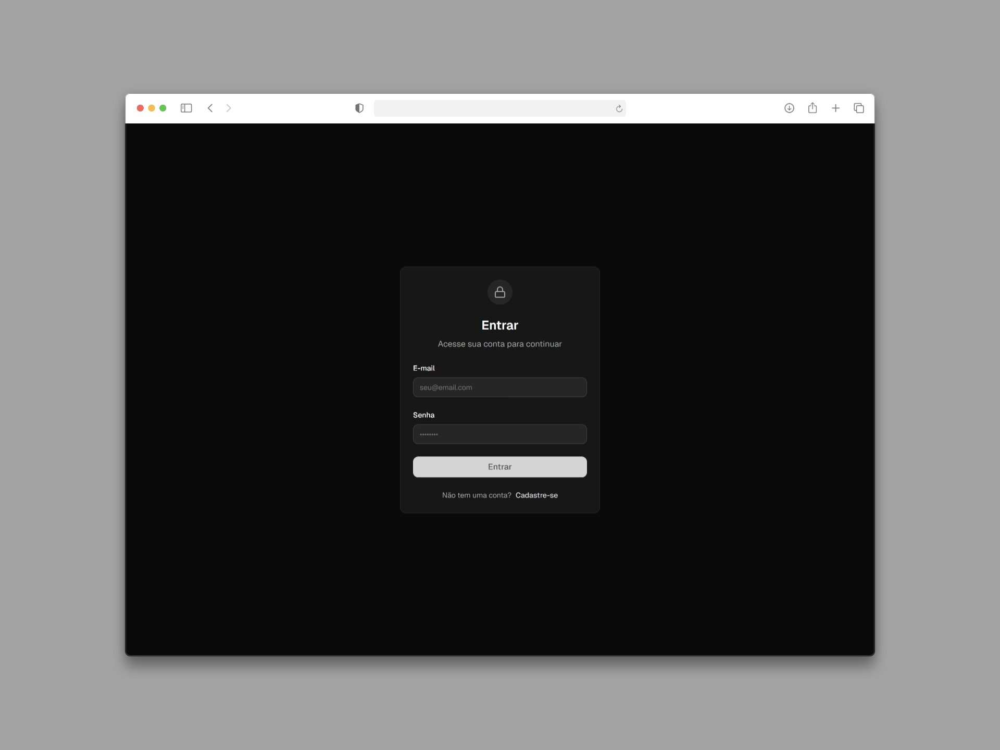

# Angular JWT Auth

Este projeto é uma aplicação de autenticação desenvolvida com Angular 19+, focada em demonstrar práticas modernas do framework, como signals para gerenciamento reativo de estado, standalone components, control flow nativo (`@if`, `@for`), e integração com uma API de autenticação JWT. A interface é estilizada com Tailwind CSS e prioriza experiência do usuário e performance.

## Objetivo

O objetivo deste projeto é servir como um exemplo prático de como construir aplicações Angular modernas e seguras, utilizando as funcionalidades mais recentes do framework. A aplicação implementa:

- Autenticação JWT com login, registro e refresh de token
- Gerenciamento de estado local com signals
- Uso de control flow nativo no template
- Componentização standalone e lazy loading de rotas
- Proteção de rotas com guards (`authGuard` e `noAuthGuard`)
- Interceptação de requisições HTTP com token JWT via Interceptors
- Interface responsiva e estilização moderna com Tailwind CSS
- Boas práticas de performance e arquitetura

## Funcionalidades

- **Login:** Autentica o usuário e armazena tokens JWT.
- **Registro:** Cria uma nova conta de usuário.
- **Perfil:** Exibe dados do usuário autenticado e permite logout.
- **Proteção de rotas:** Usuários não autenticados são redirecionados para login; usuários autenticados não acessam login/registro.
- **Diálogo de logout:** Confirmação visual para encerrar sessão.
- **Página de erro:** Exibe mensagem para rotas não encontradas.

## Pré-requisitos

- [Node.js](https://nodejs.org/en/download) (versão recomendada: 18+)
- [Angular CLI](https://v19.angular.dev/installation) (versão 19+)

> [!IMPORTANT]  
> Antes de executar o projeto, edite o arquivo `src/environments/environment.ts` e defina o valor de `apiUrl` com o endpoint da sua API.  
> Exemplo:  
>
> ```ts
> import { Environment } from '../app/core/models/environment.model';
>
> export const environment: Environment = {
>   production: false,
>   apiUrl: 'http://localhost:5080/api', // Defina a URL da sua API local aqui
>   tokenRefreshBuffer: 30,
>   storagePrefix: 'angular_jwt_auth_',
>   storage: {
>     accessTokenKey: 'access_token',
>     refreshTokenKey: 'refresh_token',
>   },
> };
> ```

## Como Executar

Siga os passos abaixo para executar o projeto:

1. Clone este repositório em sua máquina local:

   ```bash
   git clone https://github.com/kauatwn/angular-jwt-auth.git
   ```

2. Acesse a pasta do projeto:

   ```bash
   cd angular-jwt-auth
   ```

3. Instale as dependências:

   ```bash
   npm install
   ```

4. Inicie o servidor de desenvolvimento:

   ```bash
   npm start
   ```

5. Acesse a aplicação em [http://localhost:4200](http://localhost:4200).

## Screenshots

Abaixo alguns exemplos da interface da aplicação:




## Estrutura do Projeto

O projeto está organizado da seguinte forma:

```plaintext
angular-jwt-auth/
└── src/
    ├── app/
    │   ├── core/
    │   │   ├── guards/
    │   │   │   ├── auth/
    │   │   │   └── no-auth/
    │   │   ├── interceptors/
    │   │   │   └── auth/
    │   │   ├── models/
    │   │   └── services/
    │   │       ├── auth/
    │   │       └── token/
    │   ├── features/
    │   │   ├── login/
    │   │   ├── not-found/
    │   │   ├── register/
    │   │   └── user-profile/
    │   │       └── components/
    │   │           └── logout-dialog/
    │   ├── shared/
    │   │   └── validators/
    │   ├── app.component.*
    │   ├── app.config.ts
    │   └── app.routes.ts
    ├── index.html
    ├── main.ts
    └── styles.css
```

Cada funcionalidade é independente, focada em uma única responsabilidade e utiliza signals para o gerenciamento de estado. O sistema de autenticação garante segurança e persistência dos tokens JWT.
